## [Explore the interactive website →](https://real-api-pricing.vercel.app)

Compare models, prices and allowances · English / 中文

**English** | [中文](README.zh.md)

# Real API Pricing

**Real unit price = monthly subscription fee ÷ monthly usable tokens.**

Full adopted data is shown first, followed by one Pareto chart per leaderboard. Monthly figures default to four weeks of saturated use; vendor-defined monthly pools remain as defined (Kimi's monthly pool is 5× its weekly pool). Input, output and cache tokens are all included. Prices use a logarithmic axis, with cheaper points farther right.

Dollar/credit pools and three-part token prices are converted with one project-wide standard workload: **97.5% cache reads, 2.15% fresh input, and 0.35% output**. This is a comparison convention, not a claim about any provider's actual workload. Measurements that already report total tokens—dashboard back-calculations, local usage logs, controlled saturation tests, and official absolute-token tables—are not normalized again. Where only total tokens and a cost-weighted percentage are available but the token-type split is unknown, the observed total is retained and the limitation is recorded rather than inventing a split. Cache writes are not modeled separately; where a provider charges for them, converted token allowances may be overstated. See [conventions](data/conventions.json) and the [token-mix audit](data/research/token-mix-audit-round2-2026-09-07.json).

GLM Coding Plan is recomputed from Zhipu's official weekly credits and cache/input/output coefficients under the same standard workload. Peak, midpoint and off-peak scenarios are shown separately instead of copying the official 95%-cache example table. A Caijing saturation-cost test and community evidence are consistent in scale, but there is still no fully specified independent V3 Pro/Max saturation test. See the [official-table archive](data/research/quotas-web-2026-09.json) and [community-evidence review](data/research/glm-community-round1-2026-09-07.json). Step Plan CN uses StepFun's official monthly Credit pools (1M Credit = ¥1) converted through CNY list prices under the same standard workload; the international site's USD sticker prices differ and are not adopted, and the superseded Coding Plan prompt/5h limits are retained only as evidence.

Each chart uses scores from its named leaderboard only. Code Arena here specifically means the WebDev Overall Arena Score, not general coding ability. OpenDesign Arena uses the 0–100 average task score (requirements 30 + design quality 70); its cost/speed-weighted recommendation score is not used. GPT-5.6 Luna now uses a ChatGPT Plus dashboard measurement: 112.67 million total tokens consumed about 6% of the weekly allowance, giving 7.511 billion tokens/month for Plus. The 5x and 20x plans are scaled from that measured Plus baseline, so the rightmost Luna point is 150.222 billion tokens/month at medium confidence rather than the superseded 240.24 billion Sol-credit derivation. Claude Max's 15.7 billion-token estimate applies to the permanent terms from September 14, 2026, not a promotional ceiling. Chinese charts use 100-million-token units: 77.37 in Chinese equals 7.737 billion in English.

**[All charts: English / 中文, SVG / PNG](charts/README.md)** · [English files](charts/en/) · [中文文件](charts/zh/)

## Data snapshot

AA Intelligence now uses **Intelligence Index v4.3** (announced September 7, 2026); AA Coding Agent remains **v1.4**. The new intelligence methodology replaces the old snapshot as a whole: lower numerical scores are not evidence of model regression across index versions. All configurations within the selected snapshot are retained, including explicitly marked AA estimates. Historical evidence stays in `data/research/`.

Snapshot: 2026-09-09. Each row is one **plan × actual served model**; allowances of different models under the same plan are alternatives and must not be added together.

| Coverage | Rows |
|---|---:|
| All adopted plan × model points | 202 |
| Subscription points with monthly allowance | 188 |
| Metered API baselines | 13 |
| OpenCode Go / Command Code GOAT / Ollama / Step Plan | 27 / 37 / 22 / 8 |
| Code Arena / Agent Arena scored points | 136 / 140 |
| AA Intelligence / AA Coding Agent scored points | 173 / 71 |
| OpenDesign Arena scored points | 70 |
| Terminal-Bench 4.0 scored points | 70 |

**Download the data:** [adopted values (CSV)](data/adopted.csv) · [computed points (CSV)](derived/points.csv) · [computed points (JSON)](derived/points.json) · [data notes and score coverage](data/README.md) · [dated evidence](data/research/)

## API cost per row

Every row now carries an **API cost / month**: the same monthly allowance valued at the provider's official metered rates, under the same standard workload. It answers the question the real unit price implies but does not state — *what would these tokens cost if you bought them on the API instead?* The bracketed multiple is that amount ÷ the monthly fee.

`api_cost_usd_month = monthly_tokens ÷ 1,000,000 × list_blended_usd_per_mtok`, and `api_cost_multiple = api_cost_usd_month ÷ price_usd`, which is the reciprocal of the existing `d`. Published figures are computed from the published blended rate, so the columns reconcile exactly.

List prices were re-checked on 2026-09-09 against first-party pricing pages and expanded from 24 to 43 models; see the [price archive](data/research/list-prices-round2-2026-09-09.json). No mainstream rate had moved since the 2026-09-05 round.

| Price source | Rows | Meaning |
|---|---:|---|
| First-party rate card | 166 | Vendor pricing page read this round |
| Vendor docs or announcement (`*`) | 5 | Pricing page is JS-rendered or publishes no three-part split |
| Named gateway or tracker (`*`) | 8 | Open-weight or wrapper-only model with no first-party rate card |
| No defensible rate | 9 | Column left blank; no value invented |

168 of 188 rows are priced. The 11 metered API rows have no monthly allowance, so they have no API cost by construction; 9 subscription rows are served by models with no published rate — `deepseek-v4-flash-fast`, `glm-5.2-fast`, `kimi-k2.7-code-highspeed` (wrapper speed tiers), `muse-spark-1.3` and `muse-spark-1.3-contributor` (Meta publishes no 1.3 rate card, and trackers disagree on whether the 1.2 card carries over), `inkling`, `inkling-small` and `omen-alpha`.

Three limits matter when reading the column. Cache writes are still not modeled, so every figure is a **floor** for providers that bill them. 15 rows are marked `‡` because the plan's allowance for that model was itself derived from a sibling model by a list-price ratio — their API cost repeats the base row rather than resting on independent evidence, so do not read the agreement between, say, Claude Max's Opus 5 and Sonnet 5 rows as two measurements. And the multiple compares list price to a saturated subscription; it is not a claim that any user reaches that allowance.

Read against list prices, most subscriptions return far more than their fee: Claude Max 20x tops the range at about $10,715/month of Opus 5 tokens for $200 (×54), and ChatGPT Pro 20x at about $6,727 (×34). Two rows invert — Qwen3.7 Plus on Alibaba Cloud Coding Plan Pro comes to ×0.37 and ×0.62, meaning the plan costs more than buying the same tokens metered.

### Subscription value, ranked by multiple

All 168 priced rows sorted by the multiple, highest first. The dashed line marks 1× break-even: bars to its right buy more tokens than the fee would buy metered, bars to its left buy fewer. Each label carries the dollar amount behind the multiple, so a large ratio on a small base stays visible.

[English SVG](charts/en/overview/api-cost-multiple-overview.svg) · [中文 SVG](charts/zh/overview/倍数总览.svg) · [English PNG](charts/en/overview/api-cost-multiple-overview.png) · [中文 PNG](charts/zh/overview/倍数总览.png)

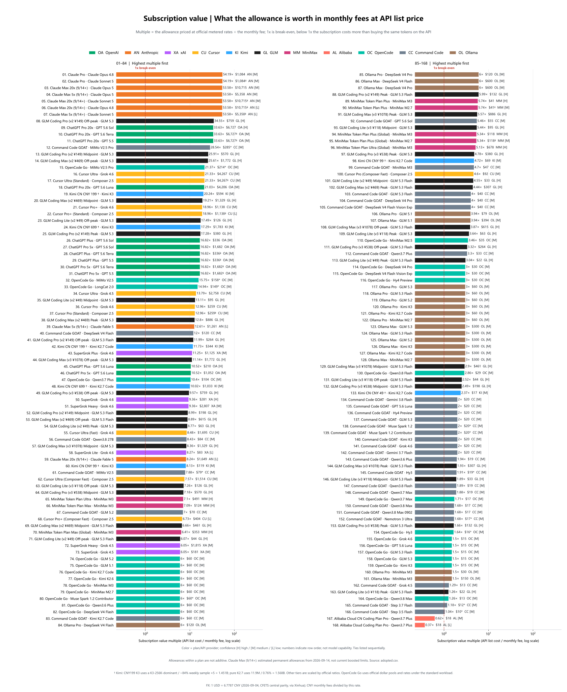

**Table:** [English TXT](charts/en/overview/api-cost-multiple-overview-table.txt) · [中文 TXT](charts/zh/overview/倍数总览表.txt)

The ranking is dominated by Anthropic and OpenAI at the top (×54 to ×34) because their list prices are the highest in the set — a plan looks better here partly because the metered alternative is expensive, not only because the allowance is large. The 20 rows without a published rate are absent from this chart rather than plotted at zero.

### Subscription value ranking, one bar per plan

The chart above ranks all 168 plan × model rows. This one collapses them to **51 subscriptions**, ranked by the value each plan's models share — the static counterpart to the comparison dashboard below.

[English SVG](charts/en/overview/plan-value-overview.svg) · [中文 SVG](charts/zh/overview/套餐性价比总览.svg) · [English PNG](charts/en/overview/plan-value-overview.png) · [中文 PNG](charts/zh/overview/套餐性价比总览.png)

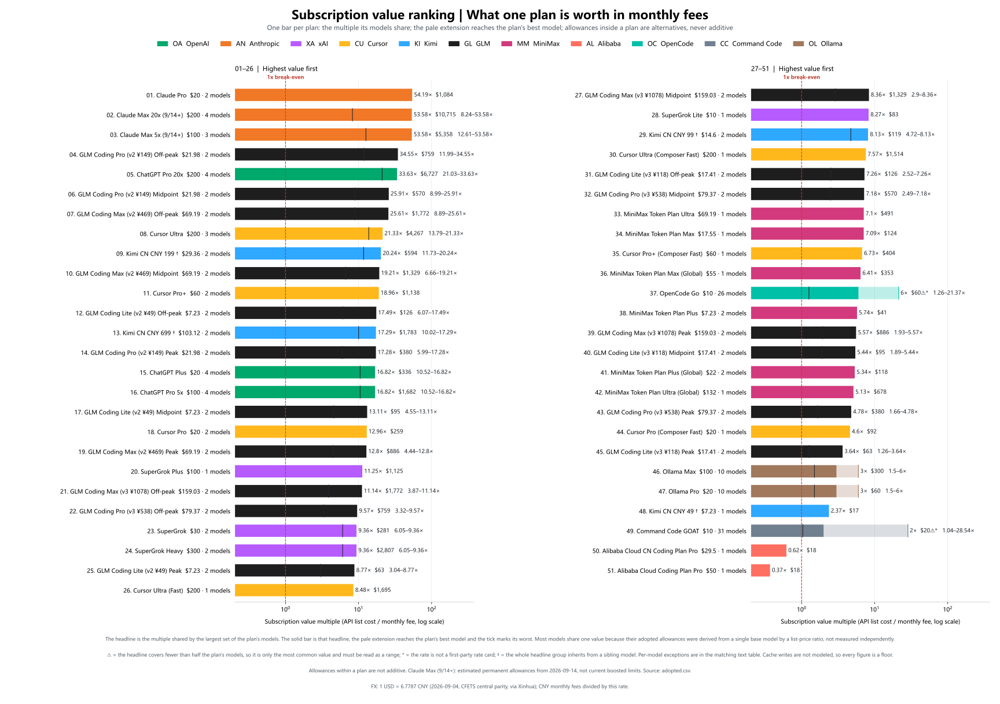

**Table:** [English TXT](charts/en/overview/plan-value-overview-table.txt) · [中文 TXT](charts/zh/overview/套餐性价比总览表.txt) — one line per plan × value group, so every exception keeps its own row

The solid bar is the shared value; the pale extension reaches the plan's **best** model and the tick marks its **worst**, so "which model you pick" and "what the plan is worth" are both visible without ever adding alternatives together. `⚠` marks the 2 plans whose headline covers fewer than half their models — OpenCode Go's ×6 sits inside a ×1.26–×21.37 spread, and Command Code GOAT's ×2 inside ×1.04–×28.54. Both are honest only as ranges.

Plan-level figures are published as [plan-value.json](derived/plan-value.json) / [plan-value.csv](derived/plan-value.csv); the site computes the same grouping client-side and a test asserts the two agree.

## Compare plans at the same price

**[Compare plans →](https://real-api-pricing.vercel.app)** · the interactive site's fourth view

Pick the plans you are actually choosing between — the five at $200, say — and the dashboard puts one row per plan side by side: the value its models **share**, with the models that land somewhere else listed underneath as their own rows.

| $200 / month | Shared value | At API list | Models sharing it | Exception |
|---|---:|---:|---|---|
| Claude Max 20x (9/14+) | ×53.6 | $10,715 | Opus 5, Sonnet 5, Opus 4.8 | ×8.2 Fable 5 ($1,649) |
| ChatGPT Pro 20x | ×33.6 | $6,727 | GPT 5.6 Sol, 5.6 Terra, 5.5 | ×21 GPT 5.6 Luna ($4,206) |
| Cursor Ultra | ×21.3 | $4,267 | Grok 4.6, Composer 2.5 | ×13.8 Grok 4.5 ($2,758) |

Rank by **value (× fee)**, **API list cost**, or **monthly fee**; the headline and its second line always show the two different numbers, so the fee-relative and absolute readings are both on screen. Every bar shares one origin and one linear scale, including the exception bars — a log axis would flatten the differences the view exists to show.

Two things the dashboard deliberately refuses to do. It never sums a plan's models: allowances inside a plan are alternatives, so the value is "pick one model and get this", not a total. And it does not print a headline for plans where one would mislead — Command Code GOAT resells 31 models at 19 distinct values, so it is flagged **value differs by model**, with the range and the best model named instead. Only 2 of the 51 priced plans fall into that case.

The shared value is shared for a reason worth knowing: on Claude Max, Sonnet 5's and Opus 4.8's allowances were derived from Opus 5's measurement by a list-price ratio, which is why all three land on ×53.6. Those models are marked `‡`. Fable 5 differs because its allowance came from a measured in-subscription weight instead — the exception is where the independent evidence actually is.

## Monthly allowance overview

The 188 subscription plan × model points are split by adopted USD monthly fee so GitHub can show them without packing every bar into one chart: **$0–30 inclusive**, **>$30 and ≤$100**, **>$100–$300**. Each band ranks monthly usable tokens independently. The undivided chart and hybrid-scale view stay in the [chart index](charts/README.md).

### $0–30

[English SVG](charts/en/overview/monthly-allowance-overview-fee-0-30-usd.svg) · [中文 SVG](charts/zh/overview/额度总览_月费0-30美元.svg) · [English PNG](charts/en/overview/monthly-allowance-overview-fee-0-30-usd.png) · [中文 PNG](charts/zh/overview/额度总览_月费0-30美元.png)

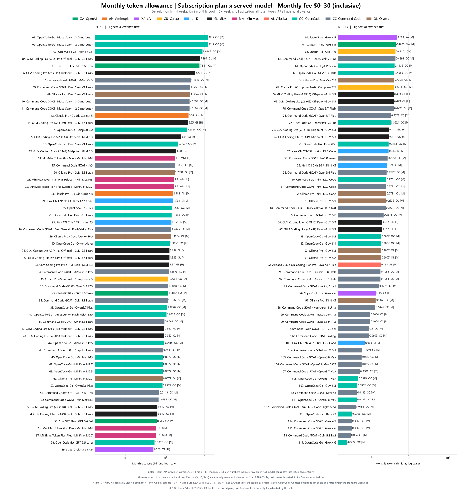

**Table:** [English TXT](charts/en/overview/monthly-allowance-overview-fee-0-30-usd-table.txt) · [中文 TXT](charts/zh/overview/额度总览表_月费0-30美元.txt)

### >$30–$100

[English SVG](charts/en/overview/monthly-allowance-overview-fee-30-100-usd.svg) · [中文 SVG](charts/zh/overview/额度总览_月费30-100美元.svg) · [English PNG](charts/en/overview/monthly-allowance-overview-fee-30-100-usd.png) · [中文 PNG](charts/zh/overview/额度总览_月费30-100美元.png)

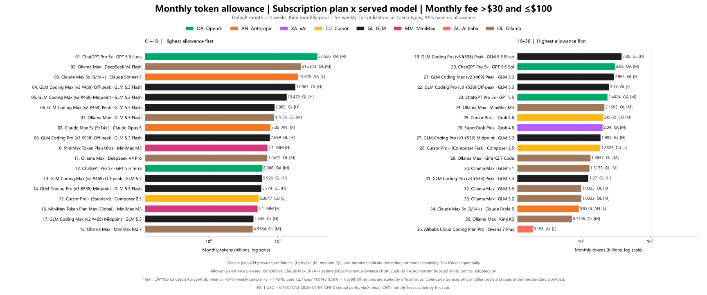

**Table:** [English TXT](charts/en/overview/monthly-allowance-overview-fee-30-100-usd-table.txt) · [中文 TXT](charts/zh/overview/额度总览表_月费30-100美元.txt)

### >$100 and ≤$300

[English SVG](charts/en/overview/monthly-allowance-overview-fee-100-300-usd.svg) · [中文 SVG](charts/zh/overview/额度总览_月费100-300美元.svg) · [English PNG](charts/en/overview/monthly-allowance-overview-fee-100-300-usd.png) · [中文 PNG](charts/zh/overview/额度总览_月费100-300美元.png)

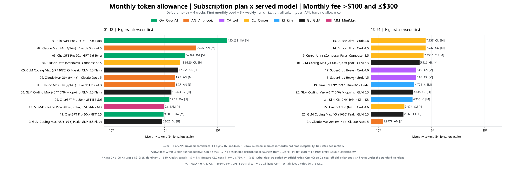

**Table:** [English TXT](charts/en/overview/monthly-allowance-overview-fee-100-300-usd-table.txt) · [中文 TXT](charts/zh/overview/额度总览表_月费100-300美元.txt)

## Real unit price overview

All 200 subscription and API points on one comparable $/MTok scale.

[English SVG](charts/en/overview/real-price-overview.svg) · [中文 SVG](charts/zh/overview/单价总览.svg) · [English PNG](charts/en/overview/real-price-overview.png) · [中文 PNG](charts/zh/overview/单价总览.png)

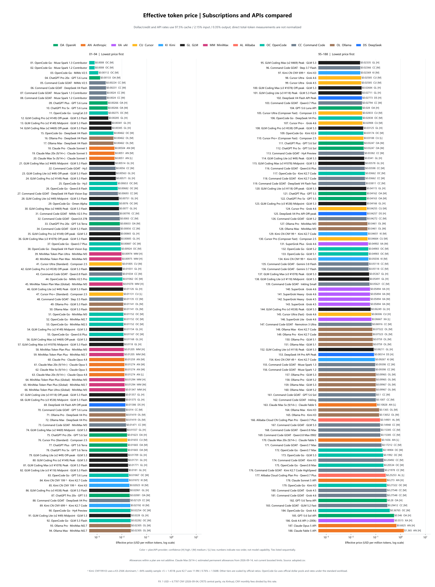

**Full table:** [English TXT](charts/en/overview/real-price-overview-table.txt) · [中文 TXT](charts/zh/overview/单价总览表.txt)

## Pareto charts by leaderboard

Using Real API Pricing as a new baseline, we plot each leaderboard's scores on the Y-axis to redraw its Pareto frontier; the connected line represents that frontier. Subscriptions and metered APIs follow the same dominance rule and both participate in frontier selection.

### Code Arena

[English SVG](charts/en/pareto/pareto-code-arena.svg) · [中文 SVG](charts/zh/pareto/帕累托_CodeArena榜.svg) · [English PNG](charts/en/pareto/pareto-code-arena.png) · [中文 PNG](charts/zh/pareto/帕累托_CodeArena榜.png)

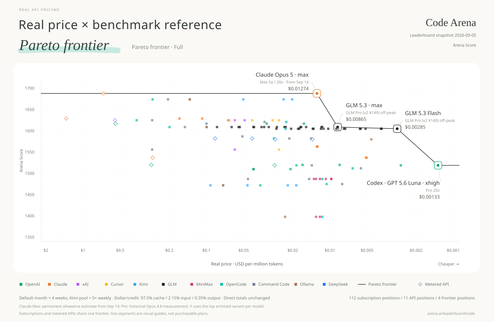

### Agent Arena

[English SVG](charts/en/pareto/pareto-agent-arena.svg) · [中文 SVG](charts/zh/pareto/帕累托_AgentArena榜.svg) · [English PNG](charts/en/pareto/pareto-agent-arena.png) · [中文 PNG](charts/zh/pareto/帕累托_AgentArena榜.png)

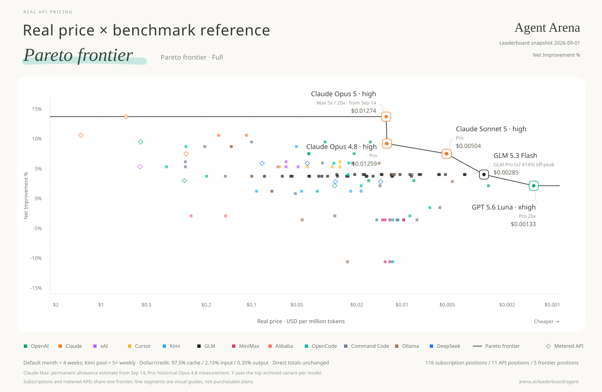

### AA Intelligence

[English SVG](charts/en/pareto/pareto-aa-intelligence.svg) · [中文 SVG](charts/zh/pareto/帕累托_AA智力榜.svg) · [English PNG](charts/en/pareto/pareto-aa-intelligence.png) · [中文 PNG](charts/zh/pareto/帕累托_AA智力榜.png)

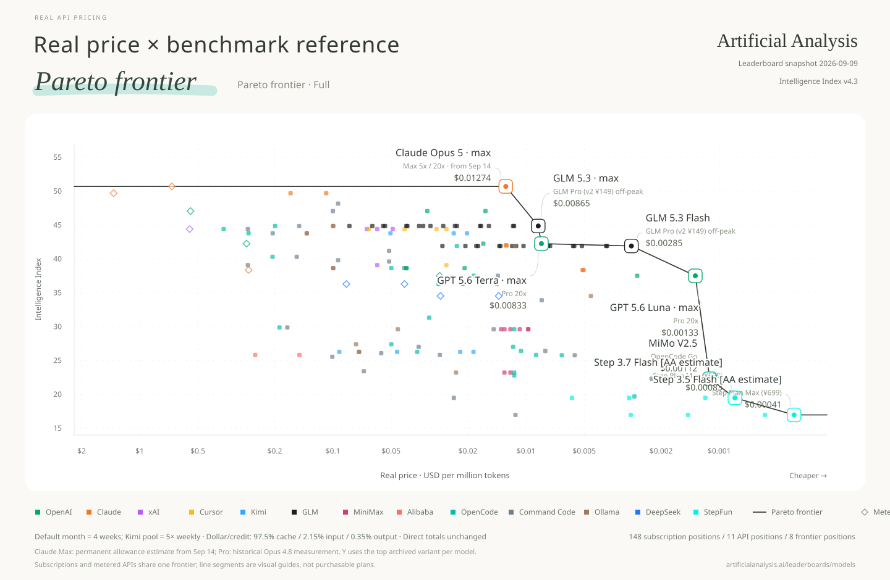

### AA Coding Agent

[English SVG](charts/en/pareto/pareto-aa-coding-agent.svg) · [中文 SVG](charts/zh/pareto/帕累托_AA编程Agent榜.svg) · [English PNG](charts/en/pareto/pareto-aa-coding-agent.png) · [中文 PNG](charts/zh/pareto/帕累托_AA编程Agent榜.png)

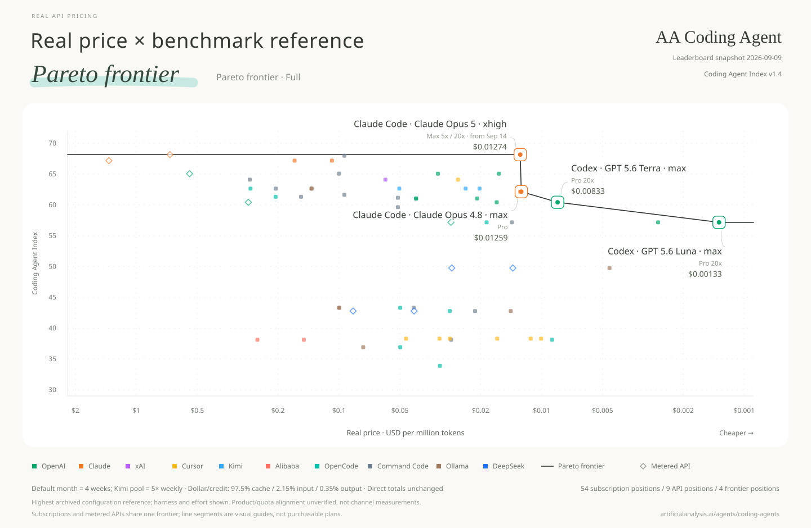

### OpenDesign Arena

[English SVG](charts/en/pareto/pareto-open-design-arena.svg) · [中文 SVG](charts/zh/pareto/帕累托_OpenDesign设计榜.svg) · [English PNG](charts/en/pareto/pareto-open-design-arena.png) · [中文 PNG](charts/zh/pareto/帕累托_OpenDesign设计榜.png)

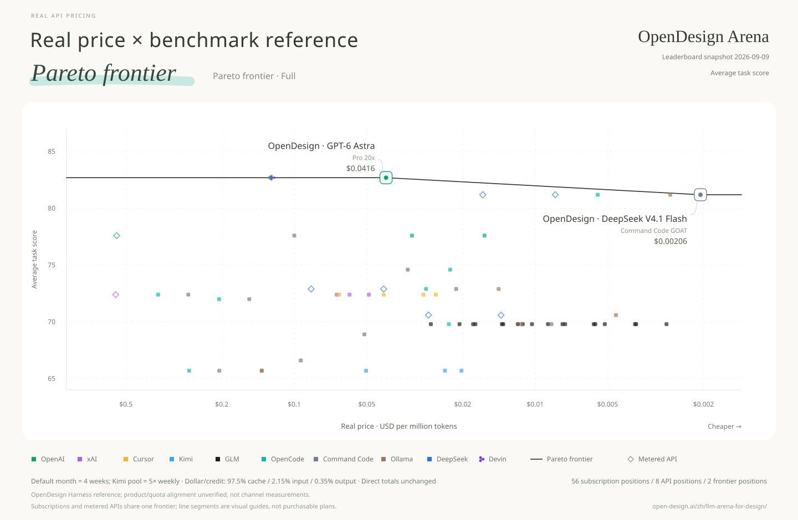

### Terminal-Bench 4.0

[English SVG](charts/en/pareto/pareto-terminal-bench-4.svg) · [中文 SVG](charts/zh/pareto/帕累托_TB4终端榜.svg) · [English PNG](charts/en/pareto/pareto-terminal-bench-4.png) · [中文 PNG](charts/zh/pareto/帕累托_TB4终端榜.png)

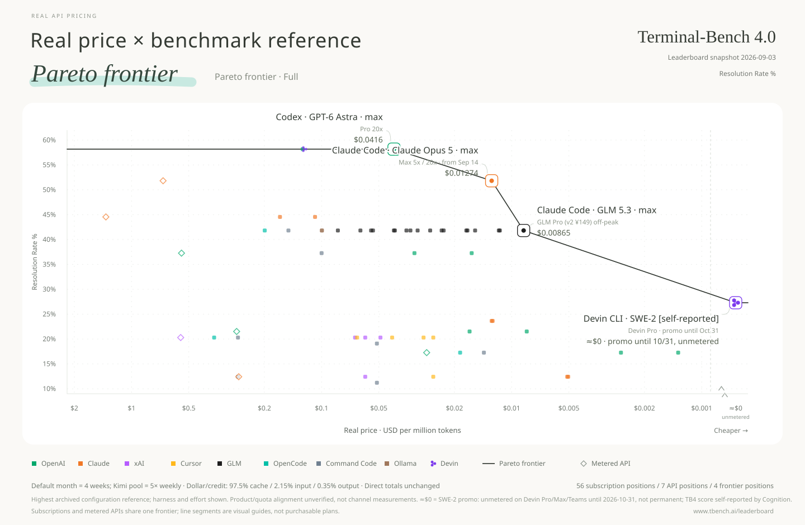

OpenDesign's full 13-model quality ranking is archived. Eleven exact model identities map to current adopted points; GPT-6 Astra and Claude Fable 5.1 remain archive-only because this project has no exact adopted row for them. DeepSeek V4.1 Flash uses the official USD list price effective September 10: $0.003 cached input / $0.15 uncached input / $0.60 output off-peak, with a separate 2× peak point. The scores are OpenDesign Harness references, not measurements of each subscription/API channel.

AA Coding Agent scores describe tested harness × model × effort configurations. Static charts and `points.*` are explicitly **highest archived configuration reference summaries**. They are not measurements of each subscription/API channel; quota-measurement effort and product harness alignment remain unverified. Higher effort does not automatically change $/MTok; it can change tokens consumed per task.

Terminal-Bench 4.0 is the official 66-task leaderboard hosted by Stanford / Harbor / the Laude Institute (snapshot 2026-09-03). Each published row is a harness × model × effort configuration, and all 18 rows are archived including GPT-6 Astra's five effort levels. Claude Fable 5.1 has no adopted plan row yet, so it stays archive-only and is listed as unscored rather than approximated. One supplemental row is appended to the official snapshot without replacing it: **SWE-2 · Devin Pro** at 27.3%, Cognition's self-reported figure from its launch post (the official board has no SWE-2 row). SWE-2 is unmetered for Pro/Max/Teams subscribers during a promotion that Cognition announced as "the next month" and that we record as ending 2026-10-31, so its real price is shown as **≈$0/MTok** on a dedicated axis slot and it becomes the cheapest frontier point. This is a promotional price, not a permanent allowance; the point must be re-evaluated when the promotion ends.

[All-configuration interactive view (Chinese)](charts/zh/pareto/帕累托交互图.html) defaults to the highest-score summary per model and offers every archived configuration plus a reasoning-effort selector as options. Download the HTML and open it locally with network access for Plotly. All configurations currently use reference mappings, not a verified product-configuration frontier.

The [configuration archive (JSON)](derived/benchmark-configurations.json) / [CSV](derived/benchmark-configurations.csv) retains all 235 records, original labels, known harness/effort, source score intervals, and source task-cost records. The [plan-to-configuration mappings (JSON)](derived/benchmark-points.json) / [CSV](derived/benchmark-points.csv) contains 1011 explicit references, including lower-effort variants. Composer Standard/Fast require their own mode; a missing mode stays unscored. Unknown harnesses, efforts and intervals stay null.

Source mean and median task costs are separate fields, not subscription task costs. Score intervals are preserved and available in interactive hover details, but uncertainty does not yet change frontier membership. Numerical quota ranges, robust-frontier analysis and workload sensitivity remain follow-up work; qualitative confidence labels are not numerical error bars.

## Method and reproduction

[Build instructions](BUILD.md) · [Data documentation](data/README.md) · [Sources and attribution](SOURCES.md)

## License and acknowledgements

Original software: [MIT](LICENSE). Data references include [Awesome Coding Plan](https://github.com/mahonzhan/awesome-coding-plan) (CC BY 4.0) and the Caijing article 《Token经济，中国账本》. See [SOURCES.md](SOURCES.md) for attribution, changes and third-party terms.
