## [打开交互网站 →](https://real-api-pricing.vercel.app)

自选模型，对比价格与额度 · 支持中英文

[English](README.md) | **中文**

# 真实 API 定价

**真实单价 = 订阅月费 ÷ 每月实际可用 token。**

先展示完整采用数据，再按榜单展示帕累托图。默认按饱和使用、每月四周计算；厂商另设独立月池时保留厂商口径（Kimi 月池为周池5倍）。输入、输出与缓存 token 全部计入；单价使用对数轴，越右越便宜。

凡是由美元/credits 额度和缓存、输入、输出三段价格换算 token，统一使用项目标准负载：**缓存读取 97.5%、普通输入 2.15%、输出 0.35%**。这是统一比较口径，不代表任何厂商或用户的实际负载。已经直接给出 total tokens 的面板反推、本地日志、受控跑满和官方绝对 token 表不再重复归一；只有 total tokens 和按费用扣减的百分比、但缺 token 类型拆分时，保留实际观测并明确限制，不编造组成。当前标准不单列 cache write；厂商另收缓存写入费时，换算结果可能偏高估 token。详见[统一口径](data/conventions.json)与[token 组成审计](data/research/token-mix-audit-round2-2026-09-07.json)。

GLM Coding Plan 现已改用智谱官方周积分和缓存/输入/输出三段积分系数，并按同一标准负载重算；忙时、中间值和闲时三个情景分开展示，不再直接抄官方95%缓存示例表。《财经》跑满成本和社区证据在量级上吻合，但目前仍没有信息完整的 V3 Pro/Max 独立跑满样本。详见[官方表存档](data/research/quotas-web-2026-09.json)与[社区证据复核](data/research/glm-community-round1-2026-09-07.json)。Step Plan 国内站按阶跃官方月度 Credit 池（1M Credit=¥1）经人民币三段价套同一标准负载折算；国际站美元牌价不同、不采用，旧 Coding Plan 的 Prompt/5h 口径仅留作证据。

六张图的 Y 轴分别取自对应榜单，分数互不混用。这里的 Code Arena 特指 WebDev Overall 的 Arena Score，不代表通用编程能力。OpenDesign Arena 使用 0–100 的任务平均分（需求完成度30分 + 设计质量70分），不采用混入成本和速度的选型参考分。GPT-5.6 Luna 现改用 ChatGPT Plus 用户面板实测：1.1267亿 total tokens 约占周额度6%，反推 Plus 75.11亿/月；5x、20x从这条实测基准按官方倍率推算，因此最右侧 Luna 点为1502.22亿/月、置信度 medium，不再采用旧的2402.4亿 Sol credits等池派生值。Claude Max 157亿则是2026年9月14日起永久口径的估算，不是活动期上限。中文图以“亿”为单位，英文图以 billion 为单位，77.37亿对应7.737 billion。

**[全部图表：中英文、SVG / PNG](charts/README.md)** · [English files](charts/en/) · [中文文件](charts/zh/)

## 数据快照

AA 智力榜改用 **Intelligence Index v4.3**（2026-09-07 发布），AA Coding Agent 仍为 **v1.4**。智力榜按新版整榜替换，不能把跨版本分数降低解释为模型能力退步。保留选定快照内的全部配置，并明确标注 AA 估计值；历史证据继续保存在 `data/research/`。

快照日期：2026-09-09。每行代表一个**套餐 × 实际服务模型**；同一套餐下不同模型的额度是替代关系，不能相加。

| 覆盖范围 | 行数 |
|---|---:|
| 全部采用的套餐 × 模型点 | 202 |
| 有月额度的订阅点 | 188 |
| 按量 API 基准点 | 13 |
| OpenCode Go / Command Code GOAT / Ollama / Step Plan | 27 / 37 / 22 / 8 |
| Code Arena / Agent Arena 有分点 | 136 / 140 |
| AA 智力榜 / AA 编程 Agent 榜有分点 | 173 / 71 |
| OpenDesign Arena 有分点 | 70 |
| Terminal-Bench 4.0 有分点 | 70 |

**下载数据：** [采用值 CSV](data/adopted.csv) · [完整计算结果 CSV](derived/points.csv) · [完整计算结果 JSON](derived/points.json) · [数据说明及缺分清单](data/README.md) · [分日期原始证据](data/research/)

## 每行的 API 标价成本

每行新增 **API 标价成本 / 月**：把该行的月额度按厂商官方按量标价、同一标准负载折算成美元。它回答真实单价隐含但没直说的问题——**同样这批 token 改成直接买 API 要花多少钱**。括号里的倍数是该金额 ÷ 订阅月费。

`api_cost_usd_month = 月 token ÷ 1,000,000 × 标价混合单价`，`api_cost_multiple = api_cost_usd_month ÷ 月费`，即已有字段 `d` 的倒数。公开数字均由公开的混合单价算出，读者用公开值可完全复现。

标价已于 2026-09-09 对照厂商一手价目页重新核对，覆盖模型从 24 个扩到 43 个，见[标价档案](data/research/list-prices-round2-2026-09-09.json)。主流模型标价与 2026-09-05 那轮相比没有变化。

| 标价来源 | 行数 | 含义 |
|---|---:|---|
| 厂商一手价目表 | 166 | 本轮直接读取厂商价目页 |
| 厂商文档或公告（`*`） | 5 | 价目页为 JS 渲染，或未给三段拆分 |
| 具名网关或追踪站（`*`） | 8 | 仅开放权重或仅在套壳产品内提供，无一手价目表 |
| 无可辩护标价 | 9 | 该列留空，不补造 |

188 行中 168 行有成本。11 条按量 API 行本身没有月额度，按定义无此列；另有 9 条订阅行的服务模型没有公开标价：`deepseek-v4-flash-fast`、`glm-5.2-fast`、`kimi-k2.7-code-highspeed`（套壳产品内的加速档），`muse-spark-1.3` 与 `muse-spark-1.3-contributor`（Meta 未公布 1.3 价目表，各追踪站对是否沿用 1.2 价目表说法冲突），以及 `inkling`、`inkling-small`、`omen-alpha`。

读这一列要注意三点。当前仍不单列缓存写入费，故所有数字都是**下限**。15 行标了 `‡`：该套餐下此模型的额度本身由同套餐基准模型按标价比推导，其成本只是把基准行的数字重复一遍，不是独立证据——例如 Claude Max 的 Opus 5 与 Sonnet 5 两行数值相同，不能当成两次测量。倍数比较的是标价与打满订阅，不代表任何用户真能用到那个额度。

按标价看，多数订阅返还远超月费：Claude Max 20x 最高，$200 换约 $10,715/月的 Opus 5 token（×54）；ChatGPT Pro 20x 约 $6,727（×34）。有两行是倒挂——阿里云百炼 Coding Plan Pro 的 Qwen3.7 Plus 为 ×0.37 与 ×0.62，即套餐比直接按量买同样的 token 更贵。

### 订阅性价比排名（按倍数排序）

全部 168 条有标价的行按倍数从高到低排列。红色虚线为 1× 盈亏线：线右侧的条，同样月费买到的 token 比直接按量买更多；线左侧的条更少。每条标签同时给出倍数背后的美元金额，避免"小基数上的大倍数"被误读。

[English SVG](charts/en/overview/api-cost-multiple-overview.svg) · [中文 SVG](charts/zh/overview/倍数总览.svg) · [English PNG](charts/en/overview/api-cost-multiple-overview.png) · [中文 PNG](charts/zh/overview/倍数总览.png)

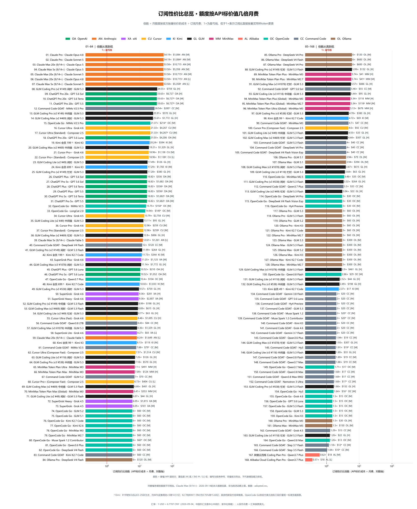

**表格：** [English TXT](charts/en/overview/api-cost-multiple-overview-table.txt) · [中文 TXT](charts/zh/overview/倍数总览表.txt)

榜首被 Anthropic 与 OpenAI 占据（×54 到 ×34），原因之一是它们的官方标价本身在本样本里最高——倍数高，部分来自"按量替代方案很贵"，不只来自"额度大"。20 条没有公开标价的行不出现在此图，而不是按 0 画出。

### 订阅性价比排名（每个套餐一条）

上一张图排的是 168 条"套餐 × 模型"。这张把它们收敛到 **51 个订阅**，按每个套餐多数模型共享的价值排序——也就是下方对比面板的静态版本。

[English SVG](charts/en/overview/plan-value-overview.svg) · [中文 SVG](charts/zh/overview/套餐性价比总览.svg) · [English PNG](charts/en/overview/plan-value-overview.png) · [中文 PNG](charts/zh/overview/套餐性价比总览.png)

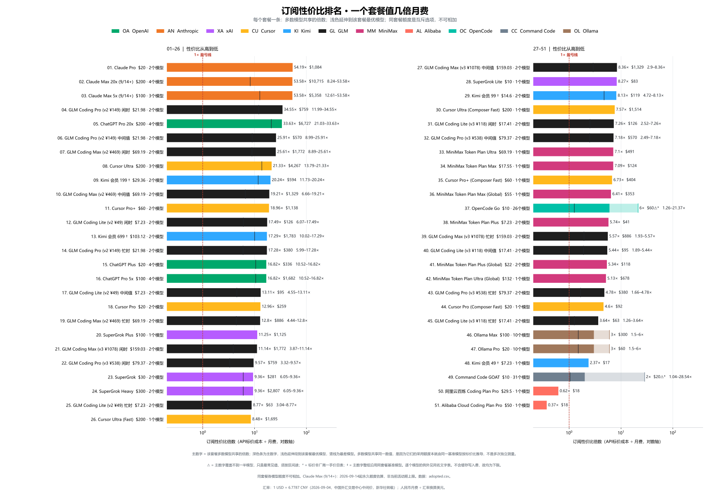

**表格：** [English TXT](charts/en/overview/plan-value-overview-table.txt) · [中文 TXT](charts/zh/overview/套餐性价比总览表.txt) —— 一行一个"套餐 × 价值组"，每个例外都保留自己的一行

深色条是共享价值，浅色延伸段到该套餐**最优**模型，竖线标出**最差**模型：这样"选哪个模型"和"套餐整体值多少"都能看到，而不必把互斥的额度加起来。`⚠` 标出主数字覆盖不到一半模型的 2 个套餐——OpenCode Go 的 ×6 落在 ×1.26–×21.37 的区间里，Command Code GOAT 的 ×2 落在 ×1.04–×28.54 里，这两个只有按区间读才成立。

套餐级数据已发布为 [plan-value.json](derived/plan-value.json) / [plan-value.csv](derived/plan-value.csv)；网站在前端算同一套分组，并有测试断言两者一致。

## 同价位套餐对比

**[打开套餐对比 →](https://real-api-pricing.vercel.app)** · 交互网站的第四个视图

选中真正在纠结的几个套餐——比如 $200 档的五个——面板会每个套餐一行并排给出：该套餐多数模型**共享**的价值，以及价值落在别处的模型，单独列成自己的一行。

| $200 / 月 | 共享价值 | 按 API 标价 | 共享此价值的模型 | 例外 |
|---|---:|---:|---|---|
| Claude Max 20x (9/14+) | ×53.6 | $10,715 | Opus 5、Sonnet 5、Opus 4.8 | ×8.2 Fable 5（$1,649） |
| ChatGPT Pro 20x | ×33.6 | $6,727 | GPT 5.6 Sol、5.6 Terra、5.5 | ×21 GPT 5.6 Luna（$4,206） |
| Cursor Ultra | ×21.3 | $4,267 | Grok 4.6、Composer 2.5 | ×13.8 Grok 4.5（$2,758） |

可按**性价比（× 月费）**、**API 标价成本**或**订阅月费**排序；主数字与其副行始终展示两个不同的数，相对月费和绝对金额同时在屏。所有条形——包括例外行的条形——共用同一原点和同一线性刻度：改用对数轴会把这个视图想要展示的差距压平。

面板刻意不做两件事。绝不把同套餐各模型相加：同套餐额度是互斥选项，价值是"选一个模型能得到这么多"，不是总量。以及，当"共享价值"会误导时就不给主数字——Command Code GOAT 转售 31 个模型、19 个不同数值，因此标注**各模型价值差异很大**，改为给出区间与最优模型。51 个有标价的套餐里只有 2 个属于这种情况。

共享价值之所以共享，其原因本身值得知道：Claude Max 下 Sonnet 5 与 Opus 4.8 的额度是由 Opus 5 的实测按标价比推导的，所以三者都落在 ×53.6，这些模型标了 `‡`。Fable 5 不同，是因为它的额度来自实测的订阅内权重——真正的独立证据其实在例外这一行。

## 月额度总览

188 个订阅套餐 × 模型点按采用数据里的美元月费拆成三档，避免 GitHub 首页一张图挤满：**$0–30（含 $30）**、**>$30 且 ≤$100**、**>$100–$300**。各档内部按月可用 token 排序。未拆档的全量图和混合比例图仍在 [图表目录](charts/README.md)。

### $0–30

[English SVG](charts/en/overview/monthly-allowance-overview-fee-0-30-usd.svg) · [中文 SVG](charts/zh/overview/额度总览_月费0-30美元.svg) · [English PNG](charts/en/overview/monthly-allowance-overview-fee-0-30-usd.png) · [中文 PNG](charts/zh/overview/额度总览_月费0-30美元.png)

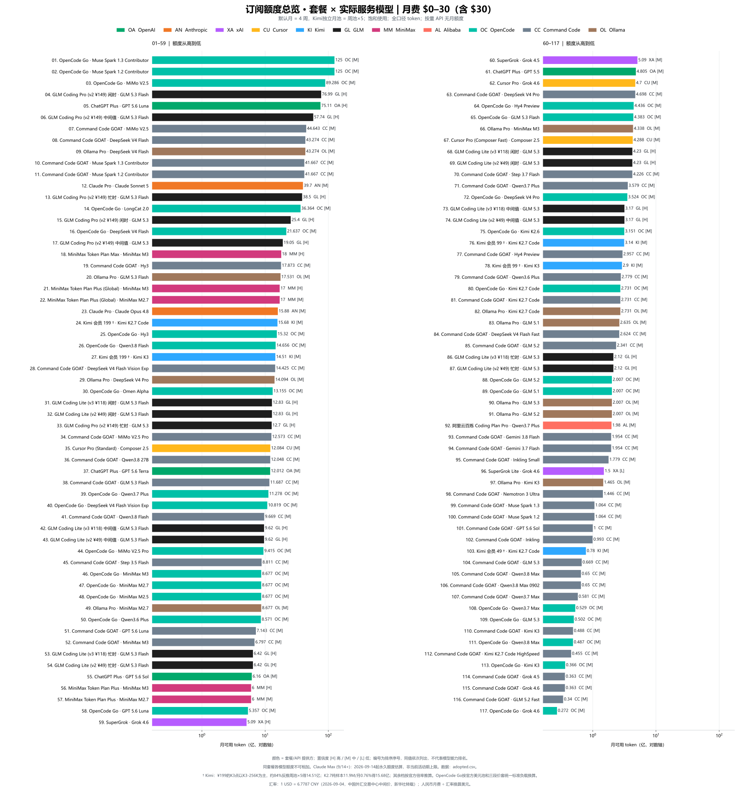

**数据表：** [中文 TXT](charts/zh/overview/额度总览表_月费0-30美元.txt) · [English TXT](charts/en/overview/monthly-allowance-overview-fee-0-30-usd-table.txt)

### >$30–$100

[English SVG](charts/en/overview/monthly-allowance-overview-fee-30-100-usd.svg) · [中文 SVG](charts/zh/overview/额度总览_月费30-100美元.svg) · [English PNG](charts/en/overview/monthly-allowance-overview-fee-30-100-usd.png) · [中文 PNG](charts/zh/overview/额度总览_月费30-100美元.png)

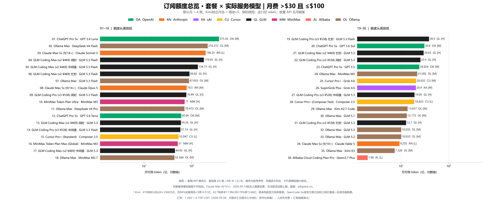

**数据表：** [中文 TXT](charts/zh/overview/额度总览表_月费30-100美元.txt) · [English TXT](charts/en/overview/monthly-allowance-overview-fee-30-100-usd-table.txt)

### >$100 且 ≤$300

[English SVG](charts/en/overview/monthly-allowance-overview-fee-100-300-usd.svg) · [中文 SVG](charts/zh/overview/额度总览_月费100-300美元.svg) · [English PNG](charts/en/overview/monthly-allowance-overview-fee-100-300-usd.png) · [中文 PNG](charts/zh/overview/额度总览_月费100-300美元.png)

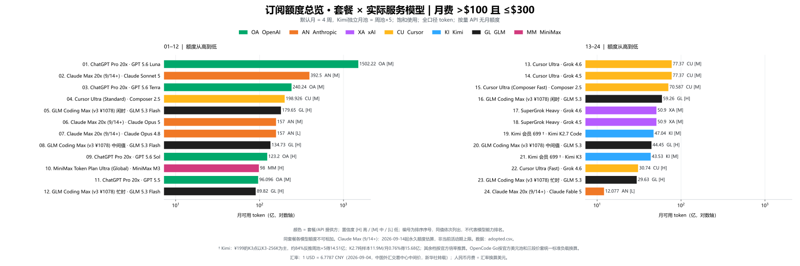

**数据表：** [中文 TXT](charts/zh/overview/额度总览表_月费100-300美元.txt) · [English TXT](charts/en/overview/monthly-allowance-overview-fee-100-300-usd-table.txt)

## 真实单价总览

把全部 200 个订阅和 API 点放在同一套 $/MTok 口径下比较。

[English SVG](charts/en/overview/real-price-overview.svg) · [中文 SVG](charts/zh/overview/单价总览.svg) · [English PNG](charts/en/overview/real-price-overview.png) · [中文 PNG](charts/zh/overview/单价总览.png)

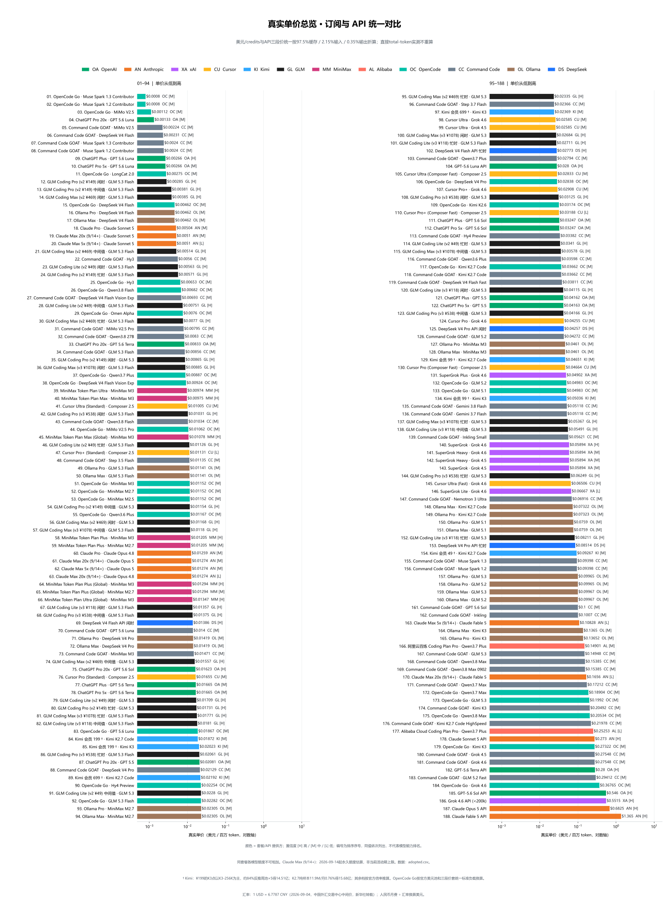

**完整数据表：** [中文 TXT](charts/zh/overview/单价总览表.txt) · [English TXT](charts/en/overview/real-price-overview-table.txt)

## 分榜帕累托图

依据“真实 API 定价”这一新基准，结合不同榜单的分数作为 Y 轴，重新绘制帕累托前沿图；图中的连线即代表帕累托前沿。订阅与按量 API 使用同一支配规则，共同参与前沿筛选。

### Code Arena

[English SVG](charts/en/pareto/pareto-code-arena.svg) · [中文 SVG](charts/zh/pareto/帕累托_CodeArena榜.svg) · [English PNG](charts/en/pareto/pareto-code-arena.png) · [中文 PNG](charts/zh/pareto/帕累托_CodeArena榜.png)

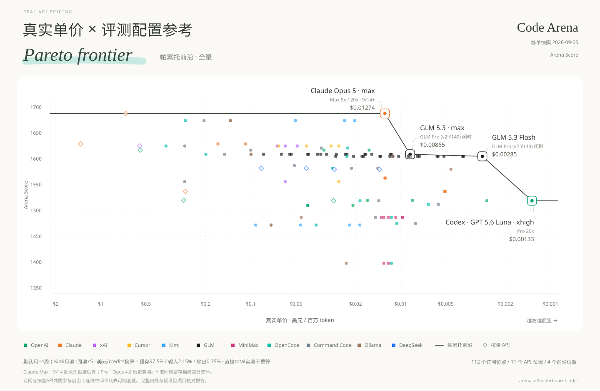

### Agent Arena

[English SVG](charts/en/pareto/pareto-agent-arena.svg) · [中文 SVG](charts/zh/pareto/帕累托_AgentArena榜.svg) · [English PNG](charts/en/pareto/pareto-agent-arena.png) · [中文 PNG](charts/zh/pareto/帕累托_AgentArena榜.png)

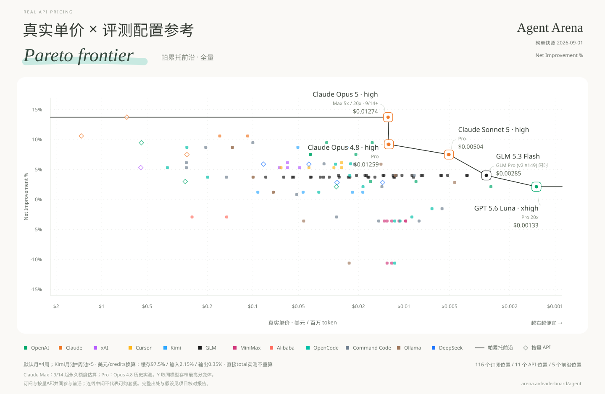

### AA Intelligence

[English SVG](charts/en/pareto/pareto-aa-intelligence.svg) · [中文 SVG](charts/zh/pareto/帕累托_AA智力榜.svg) · [English PNG](charts/en/pareto/pareto-aa-intelligence.png) · [中文 PNG](charts/zh/pareto/帕累托_AA智力榜.png)

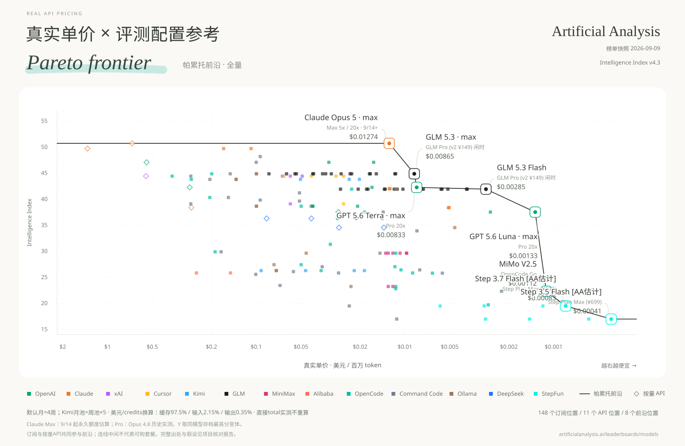

### AA Coding Agent

[English SVG](charts/en/pareto/pareto-aa-coding-agent.svg) · [中文 SVG](charts/zh/pareto/帕累托_AA编程Agent榜.svg) · [English PNG](charts/en/pareto/pareto-aa-coding-agent.png) · [中文 PNG](charts/zh/pareto/帕累托_AA编程Agent榜.png)

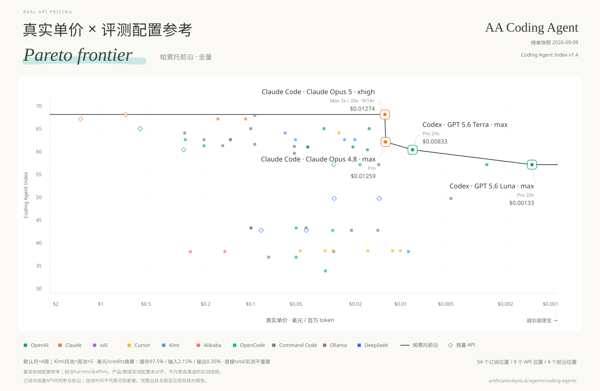

### OpenDesign Arena

[English SVG](charts/en/pareto/pareto-open-design-arena.svg) · [中文 SVG](charts/zh/pareto/帕累托_OpenDesign设计榜.svg) · [English PNG](charts/en/pareto/pareto-open-design-arena.png) · [中文 PNG](charts/zh/pareto/帕累托_OpenDesign设计榜.png)

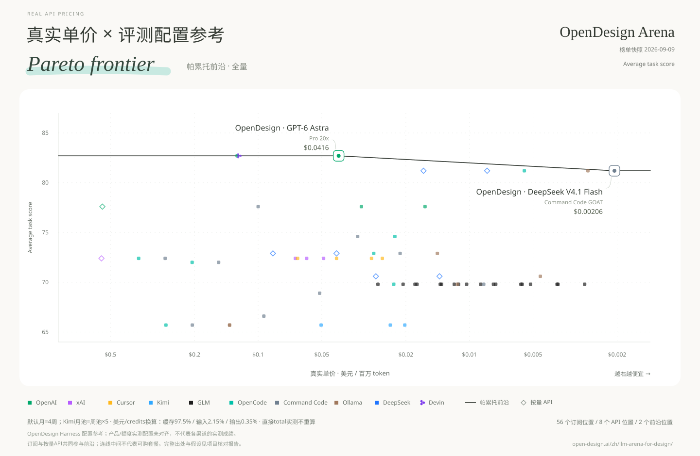

### Terminal-Bench 4.0

[English SVG](charts/en/pareto/pareto-terminal-bench-4.svg) · [中文 SVG](charts/zh/pareto/帕累托_TB4终端榜.svg) · [English PNG](charts/en/pareto/pareto-terminal-bench-4.png) · [中文 PNG](charts/zh/pareto/帕累托_TB4终端榜.png)

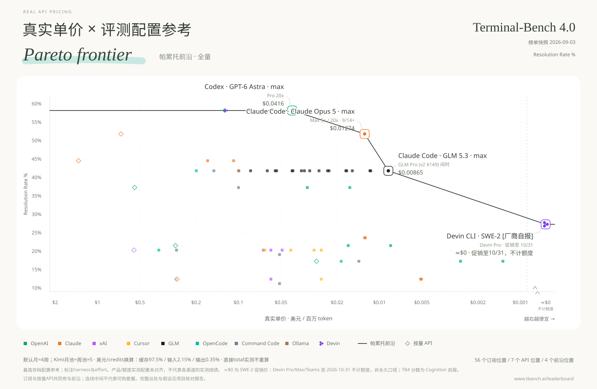

OpenDesign 的 13 模型完整效果榜已存档，其中 11 个模型与当前采用点精确映射；GPT-6 Astra、Claude Fable 5.1 因项目暂无精确采用行，只保留榜单记录，不借用邻近型号。DeepSeek V4.1 Flash 采用 9 月 10 日起生效的官方美元标价：闲时缓存输入 $0.003、未缓存输入 $0.15、输出 $0.60，并另列高峰 2 倍价。分数属于 OpenDesign Harness 配置参考，不代表各订阅/API渠道实测。

AA 编程 Agent 分数属于已测试的 harness × 模型 × effort 配置。静态图和 `points.*` 明确为**最高存档配置参考汇总**，不代表各订阅/API渠道实测；额度样本的effort、产品harness是否对齐仍未验证。更高effort不自动提高每百万token单价，但可能增加每任务token消耗。

Terminal-Bench 4.0 是 Stanford / Harbor / Laude Institute 托管的 66 任务官方榜（快照 2026-09-03）。每行是一个 harness × 模型 × effort 配置，18 行全部存档，包括 GPT-6 Astra 的五个 effort 档。Claude Fable 5.1 暂无采用行，只保留榜单记录并列入缺分，不做近似。另有一行补充档追加在官方快照之后、不替换快照：**SWE-2 · Devin Pro** 27.3%，来自 Cognition 发布博客的自报数字（官方榜无 SWE-2 行）。SWE-2 在促销期内对 Pro/Max/Teams 订阅者不计额度，官推只写 "the next month"，本项目记为截止 2026-10-31，因此真实单价显示为 **≈$0/MTok**、放在专用刻度位，并成为前沿最便宜端点。这是促销价而非永久口径，促销结束后必须复核。

[全配置交互图](charts/zh/pareto/帕累托交互图.html) 默认展示每模型最高分汇总，可切换全部存档配置，并提供思考强度档位选择。下载HTML后本地打开，Plotly需要联网。目前全部采用参考映射，尚不是已验证产品配置的严格前沿。

[评测配置JSON](derived/benchmark-configurations.json) / [CSV](derived/benchmark-configurations.csv) 完整保留235条记录、原始标签、已知harness/effort、来源分数区间和来源任务成本。[套餐配置映射JSON](derived/benchmark-points.json) / [CSV](derived/benchmark-points.csv) 包含1011条明确参考映射，保留低effort配置。Composer Standard/Fast只匹配本模式，缺失时留空；未知harness、effort、区间均不推测。

来源任务成本的均值和中位数分别保留，不作为订阅内任务成本。分数区间可在交互图悬停查看，目前尚不参与前沿筛选。额度数值范围、稳健前沿和负载敏感性分析留待后续；不把定性置信度编成误差百分比。

## 口径与复现

[构建说明](BUILD.md) · [数据文档](data/README.md) · [来源与署名](SOURCES.md)

## 许可与致谢

原创代码采用 [MIT](LICENSE)。数据参考 [Awesome Coding Plan](https://github.com/mahonzhan/awesome-coding-plan)（CC BY 4.0）及《财经》的《Token经济，中国账本》等。署名、改动和第三方许可见 [SOURCES.md](SOURCES.md)。
